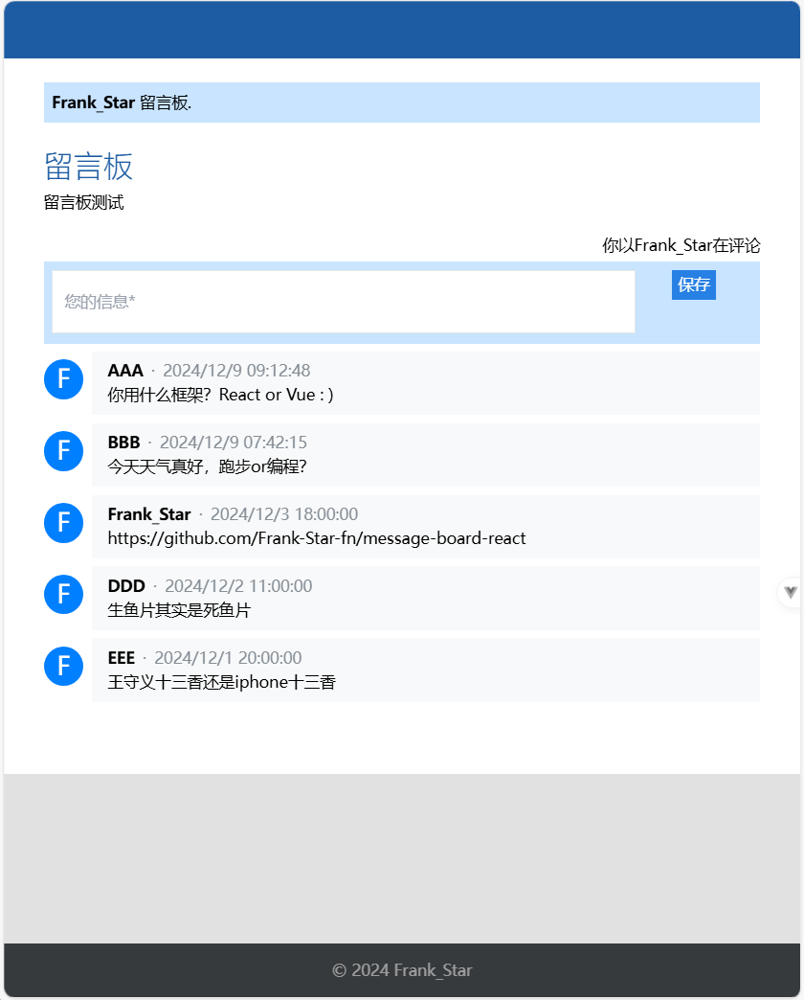

# Message Board by Vue
一个简易留言板。前端基于Vue3+Tailwind CSS，后端基于Node.js，数据库为MySQL。UI界面参考
[Xoyondo留言板](https://xoyondo.com/zh/create-personal-message-board)\
推荐页面大小800x1000.

## Screenshot



## Recommended IDE Setup
[VSCode](https://code.visualstudio.com/) + [Volar](https://marketplace.visualstudio.com/items?itemName=Vue.volar) (and disable Vetur).


## Project Setup
```sh
npm install
```

### Compile and Hot-Reload for Development
```sh
npm run dev
```

