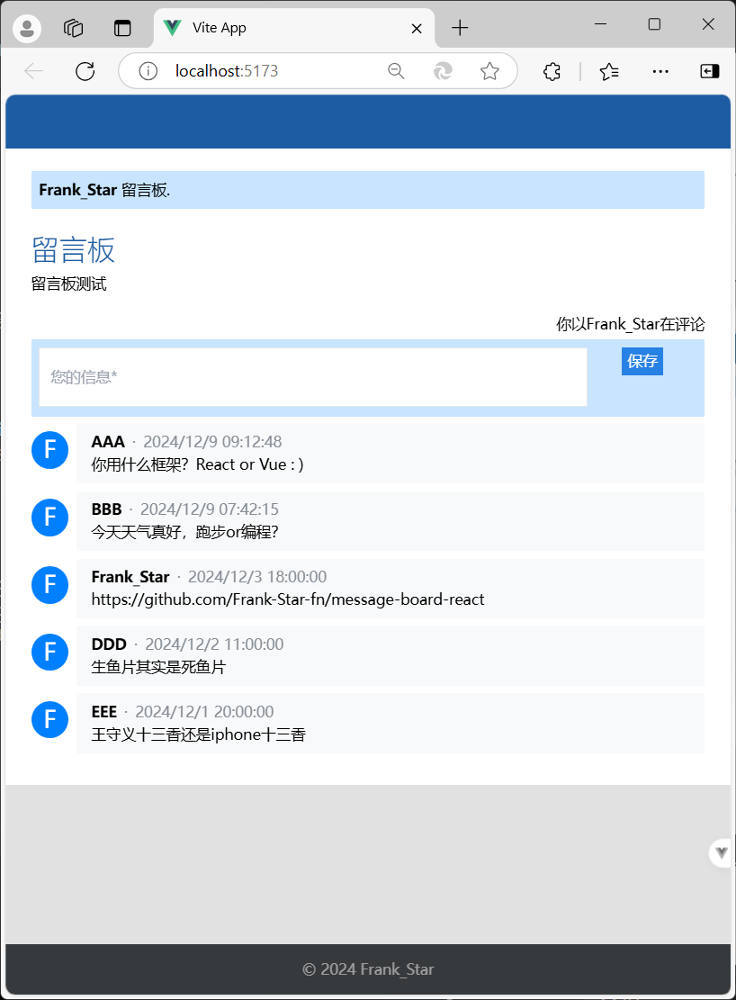

# Message Board by Vue

## update

增加了绿色主题可供选择，新增删除留言功能。

## 简介

一个简易留言板。\
技术栈: \
前端: Vue3 + Tailwind CSS + Less \
后端: Node.js + Express\
数据库: MySQL \
UI界面参考
[Xoyondo留言板](https://xoyondo.com/zh/create-personal-message-board), 推荐页面大小为800x1000.

## Screenshot

<div align=center>

</div>
<!--  -->

## Recommended IDE Setup

[VSCode](https://code.visualstudio.com/) + [Volar](https://marketplace.visualstudio.com/items?itemName=Vue.volar) (and disable Vetur).

## Project Setup

```sh
cnpm install
```

### Run

```sh
# 启动前端
cd vue3
npm run dev

# 启动后端
cd server
node server.js
```
